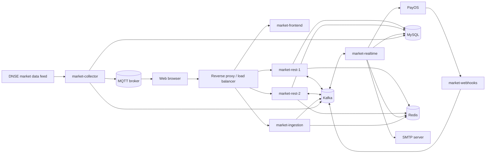

# FinSight Docker Deployment and System Setup Guide

**Project:** FinSight  
**Document purpose:** Installation, configuration, deployment, verification, and maintenance guide  
**Intended audience:** Thesis evaluators, developers, system administrators, and deployment engineers  
**Last reviewed:** June 24, 2026  
**Repository deployment file:** `docker-compose.yml`

---

## Contents

1. [Document Scope](#1-document-scope)
2. [System Overview](#2-system-overview)
3. [Important Deployment Characteristics](#3-important-deployment-characteristics)
4. [Recommended Deployment Environments](#4-recommended-deployment-environments)
5. [Install Docker](#5-install-docker)
6. [Obtain the Source Code](#6-obtain-the-source-code)
7. [Configure Environment Variables](#7-configure-environment-variables)
8. [Deployment Option A: Existing Infrastructure](#8-deployment-option-a-existing-infrastructure)
9. [Deployment Option B: Local Docker Infrastructure](#9-deployment-option-b-local-docker-infrastructure-demonstration)
10. [Verification Procedure](#10-verification-procedure)
11. [Loading or Restoring Demonstration Data](#11-loading-or-restoring-demonstration-data)
12. [Production Reverse Proxy and TLS](#12-production-reverse-proxy-and-tls)
13. [Security Checklist](#13-security-checklist)
14. [Routine Operations](#14-routine-operations)
15. [Backup and Recovery](#15-backup-and-recovery)
16. [Troubleshooting](#16-troubleshooting)
17. [Thesis Demonstration Checklist](#17-thesis-demonstration-checklist)
18. [Known Repository-Level Deployment Limitations](#18-known-repository-level-deployment-limitations)
19. [Official Technical References](#19-official-technical-references)
20. [Quick Command Summary](#20-quick-command-summary)

---

## 1. Document Scope

This document explains how to deploy FinSight with Docker. It covers:

- the system architecture and responsibility of each service;
- required software and hardware;
- Docker installation;
- external infrastructure requirements;
- environment-variable configuration;
- image building and container startup;
- local-development access through a reverse proxy;
- production deployment considerations;
- database and Kafka initialization;
- service verification;
- logs, backup, update, shutdown, and troubleshooting procedures.

The repository's main `docker-compose.yml` builds and runs the FinSight application services. It does **not** create MySQL, Redis, Kafka, MQTT, a public load balancer, DNS, or TLS certificates. These dependencies must be supplied separately.

> **Important:** Do not commit a populated `.env` file. It contains database passwords, payment credentials, email credentials, and external data-feed credentials.

---

## 2. System Overview

FinSight uses a microservice and event-driven architecture.



### 2.1 Main runtime flows

1. **REST request/response flow**

   - The browser calls `market-rest`.
   - `market-rest` handles direct read operations through MySQL and cache operations through Redis.
   - Business operations are published to Kafka.
   - `market-realtime` consumes the Kafka message, routes it to the corresponding service, updates MySQL or Redis, and returns a response through Kafka.

2. **Financial-data ingestion flow**

   - An administrator uploads a spreadsheet to `market-ingestion`.
   - The service validates and temporarily stages the records.
   - After confirmation, the records are published to Kafka.
   - `market-realtime` consumes and stores the records.

3. **Live-market-data flow**

   - `market-collector` connects to the external DNSE data feed.
   - Tick updates are published to Kafka for backend processing.
   - Tick updates are also published to MQTT for browser subscribers.

4. **Payment flow**

   - FinSight creates a payment through PayOS.
   - PayOS sends a signed callback to `market-webhooks`.
   - `market-webhooks` verifies the callback and publishes the result to Kafka.
   - `market-realtime` updates the subscription state.

### 2.2 Application containers

| Compose service | Technology | Container port | Fixed Docker IP | Responsibility |
|---|---|---:|---|---|
| `market-rest-1` | Node.js 24, Express, TypeScript | 3000 | `10.255.254.10` | REST API replica 1 |
| `market-rest-2` | Node.js 24, Express, TypeScript | 3000 | `10.255.254.11` | REST API replica 2 |
| `market-frontend` | React/Vite build served by Nginx | 80 | `10.255.254.12` | Browser user interface |
| `market-ingestion` | Java 21, Spring Boot | 1111 | `10.255.254.13` | Spreadsheet validation and ingestion |
| `market-realtime` | Java 21, Spring Boot | 8080 | `10.255.254.14` | Kafka processing and core business logic |
| `market-collector` | Java 21, Spring Boot | 8080 | `10.255.254.15` | External live-market-data collector |
| `market-webhooks` | Java 21, Spring Boot | 5000 | `10.255.254.16` | PayOS webhook verification |

Both REST replicas use the same image but different Kafka consumer group IDs. A reverse proxy should distribute HTTP requests between them.

---

## 3. Important Deployment Characteristics

### 3.1 External infrastructure is required

The main Compose file expects these services to be reachable:

| Dependency | Purpose | Typical port |
|---|---|---:|
| MySQL | Persistent users, stocks, financial records, subscriptions, and AHP settings | 3306 |
| Redis | Cache and temporary ingestion state | 6379 |
| Kafka | Inter-service messages and request/response operations | 9092 |
| MQTT broker | Browser delivery of real-time stock prices | 1883 and a WebSocket port |
| SMTP server | Welcome and valuation-alert email | 587 |
| PayOS | Payment-link creation and webhook verification | HTTPS |
| DNSE data feed | Live Vietnamese stock-market ticks | Secure WebSocket/MQTT |

### 3.2 The main Compose file does not publish host ports

`docker-compose.yml` assigns fixed addresses on `10.255.254.0/24`, but it does not contain `ports:` mappings.

Consequences:

- on a Linux Docker host, a host-level reverse proxy may route directly to `10.255.254.10` through `10.255.254.16`;
- containers on the same Docker network can use service names;
- Docker Desktop on Windows or macOS generally does not expose Linux bridge addresses directly to the host;
- a local port-publishing override or a reverse-proxy container is required for browser access.

### 3.3 Frontend variables are build-time values

The `VITE_*` variables are compiled into the frontend JavaScript during `docker compose build`. Changing these values in `.env` does not update an existing image.

After changing a frontend URL, rebuild it:

```bash
docker compose --env-file .env build --no-cache market-frontend
docker compose --env-file .env up -d --force-recreate market-frontend
```

### 3.4 Database schema and initial data

`market-realtime` uses:

```yaml
spring:
  jpa:
    hibernate:
      ddl-auto: update
```

Therefore, it can create or update mapped tables when it connects to MySQL.

The repository does not contain a complete SQL migration or seed-data package. A new database may have the schema but no stocks, subscription plans, users, or historical financial records. A production or thesis demonstration deployment should restore an approved database dump or load the required data separately.

---

## 4. Recommended Deployment Environments

### 4.1 Production or thesis demonstration server

Recommended baseline for the application stack and a small single-node infrastructure stack:

- 64-bit Ubuntu Server;
- 4 CPU cores or more;
- 8 GB RAM minimum, 16 GB recommended;
- 30 GB free SSD space minimum;
- stable internet access for image and dependency downloads;
- a public domain name if PayOS webhooks, HTTPS, or remote browser access are required;
- firewall access only for HTTP/HTTPS and required administration ports.

Resource usage depends on Kafka retention, MySQL data size, build concurrency, and test load.

### 4.2 Developer workstation

- Linux, Windows with WSL 2, or macOS;
- Docker Desktop or Docker Engine with the Compose plugin;
- 8 GB RAM minimum;
- 15 GB free disk space for source, images, build caches, and volumes.

Linux is the closest match to the repository's fixed bridge-network design.

---

## 5. Install Docker

The commands below are for Ubuntu. For another operating system, use the official Docker installation guide:

- Ubuntu: <https://docs.docker.com/engine/install/ubuntu/>
- Windows: <https://docs.docker.com/desktop/setup/install/windows-install/>
- macOS: <https://docs.docker.com/desktop/setup/install/mac-install/>
- Compose plugin: <https://docs.docker.com/compose/install/linux/>

### 5.1 Ubuntu installation

Remove conflicting packages:

```bash
for pkg in docker.io docker-doc docker-compose docker-compose-v2 podman-docker containerd runc; do
  sudo apt-get remove "$pkg"
done
```

Add Docker's official APT repository:

```bash
sudo apt-get update
sudo apt-get install -y ca-certificates curl
sudo install -m 0755 -d /etc/apt/keyrings
sudo curl -fsSL https://download.docker.com/linux/ubuntu/gpg \
  -o /etc/apt/keyrings/docker.asc
sudo chmod a+r /etc/apt/keyrings/docker.asc

echo \
  "deb [arch=$(dpkg --print-architecture) signed-by=/etc/apt/keyrings/docker.asc] https://download.docker.com/linux/ubuntu \
  $(. /etc/os-release && echo "${UBUNTU_CODENAME:-$VERSION_CODENAME}") stable" |
  sudo tee /etc/apt/sources.list.d/docker.list > /dev/null
```

Install Docker Engine and the Compose plugin:

```bash
sudo apt-get update
sudo apt-get install -y \
  docker-ce \
  docker-ce-cli \
  containerd.io \
  docker-buildx-plugin \
  docker-compose-plugin
```

Enable Docker:

```bash
sudo systemctl enable --now docker
```

Allow the current user to run Docker without `sudo`:

```bash
sudo usermod -aG docker "$USER"
```

Log out and log back in after changing group membership.

### 5.2 Verify Docker

```bash
docker version
docker compose version
docker run --rm hello-world
```

The FinSight Compose configuration was validated on June 24, 2026 with:

- Docker Engine `29.5.2`;
- Docker Compose `v5.1.4`.

Newer compatible releases should also work.

---

## 6. Obtain the Source Code

Clone the repository and enter its root directory:

```bash
git clone <FINSIGHT_REPOSITORY_URL>
cd FinSight
```

Confirm the expected files exist:

```bash
ls docker-compose.yml .env.example recreate-docker.sh
```

The deployment commands in this document must be run from the repository root.

---

## 7. Configure Environment Variables

Create a private environment file:

```bash
cp .env.example .env
chmod 600 .env
```

Edit it:

```bash
nano .env
```

Do not leave required values empty. Compose uses the `:?` validation form for several variables and will stop with an error if they are missing or blank.

### 7.1 Database variables

| Variable | Required | Description | Example |
|---|---|---|---|
| `DB_HOST` | Yes | MySQL hostname used by Node.js | `mysql` |
| `DB_PORT` | No | MySQL TCP port | `3306` |
| `DB_JDBC_URL` | Yes | JDBC URL used by Java services | `jdbc:mysql://mysql:3306/finsight` |
| `DB_USER` | Yes | Application database user | `finsight` |
| `DB_PASSWORD` | Yes | Application database password | strong secret |
| `DB_NAME` | Yes | Database/schema name | `finsight` |

For an external TLS-enabled database, add the parameters required by that provider to `DB_JDBC_URL`.

### 7.2 Redis variables

| Variable | Required | Description | Default |
|---|---|---|---|
| `REDIS_HOST` | Yes | Redis hostname | none |
| `REDIS_PORT` | No | Redis TCP port | `6379` |
| `REDIS_PASSWORD` | Recommended | Redis password | empty |
| `REDIS_DATABASE` | No | Logical Redis database | `0` |
| `REDIS_CACHE_TTL` | No | REST cache lifetime in seconds | `3600` |

### 7.3 Kafka variables

| Variable | Required | Description | Default |
|---|---|---|---|
| `KAFKA_URLS` | Yes | Comma-separated broker addresses | none |
| `KAFKA_TOPIC_MARKET_DATA` | No | Live market-data topic | `market-data` |
| `KAFKA_TOPIC_WEBHOOKS` | No | Payment result topic | `market-payment` |
| `KAFKA_TOPIC_REST` | No | REST request/response topic | `market-rest` |
| `KAFKA_TOPIC_INGESTION` | No | Ingestion topic | `market-ingestion` |
| `KAFKA_TOPIC_INGESTION_REPLY` | No | Optional ingestion reply topic | empty |
| `KAFKA_REQUEST_TIMEOUT_MS` | No | REST request timeout | `15000` |

All application containers must receive broker addresses that are reachable **from inside their containers**. Do not use `localhost:9092` unless Kafka runs in the same container, which it normally does not.

### 7.4 MQTT variables

| Variable | Required | Description | Example |
|---|---|---|---|
| `MQTT_URL` | For live data | Backend MQTT URL | `tcp://mosquitto:1883` |
| `MQTT_USERNAME` | Depends on broker | MQTT username | `finsight` |
| `MQTT_PASSWORD` | Depends on broker | MQTT password | strong secret |
| `MQTT_TOPIC_MARKET_DATA` | No | Live-price topic | `market-data` |

Browser clients require MQTT over WebSocket (`ws://` or `wss://`), not raw TCP MQTT.

### 7.5 DNSE data-feed variables

| Variable | Required for collector | Description |
|---|---|---|
| `DATAFEED_TOKENURL` | Yes | DNSE token endpoint |
| `DATAFEED_INVERSTORURL` | Yes | Investor/account endpoint; spelling follows the current code |
| `DATAFEED_WEBSOCKETURL` | Yes | DNSE market-data WebSocket/MQTT endpoint |
| `DATAFEED_USERNAME` | Depends on provider | Data-feed login |
| `DATAFEED_PASSWORD` | Depends on provider | Data-feed password |

These credentials should come from an authorized DNSE account. The collector may fail during startup if they are invalid.

### 7.6 PayOS variables

| Variable | Required | Description |
|---|---|---|
| `PAYOS_CLIENT_ID` | Yes | PayOS client identifier |
| `PAYOS_API_KEY` | Yes | PayOS API key |
| `PAYOS_CHECKSUM_KEY` | Yes | PayOS signature/checksum key |

Use sandbox/test credentials for a thesis demonstration when possible. The webhook URL must be publicly reachable through HTTPS for PayOS to call it.

### 7.7 Email variables

| Variable | Required for email | Description | Example |
|---|---|---|---|
| `MAIL_HOST` | Yes | SMTP host | `smtp.gmail.com` |
| `MAIL_PORT` | Yes | SMTP submission port | `587` |
| `MAIL_USERNAME` | Yes | SMTP username | email address |
| `MAIL_PASSWORD` | Yes | SMTP password or app password | secret |

Use an application-specific SMTP password where the provider supports it.

### 7.8 Frontend variables

| Variable | Required | Description |
|---|---|---|
| `VITE_API_BASE_URL` | Yes | Public REST endpoint before `/api` |
| `VITE_INGESTION_API_BASE_URL` | Yes | Public ingestion endpoint before `/api` |
| `VITE_MQTT_BROKER_URL` | Yes | Public MQTT WebSocket endpoint |
| `VITE_MQTT_TOPIC` | No | Browser subscription topic |

Example behind one public reverse proxy:

```dotenv
VITE_API_BASE_URL=https://finsight.example.edu
VITE_INGESTION_API_BASE_URL=https://finsight.example.edu/ingestion
VITE_MQTT_BROKER_URL=wss://mqtt.finsight.example.edu/mqtt
VITE_MQTT_TOPIC=market-data
APP_DOMAIN=finsight.example.edu
```

### 7.9 Validate configuration without starting containers

```bash
docker compose --env-file .env -f docker-compose.yml config --quiet
```

No output and exit code `0` indicate valid Compose syntax and completed required-variable interpolation.

To inspect the rendered model, use:

```bash
docker compose --env-file .env -f docker-compose.yml config
```

The rendered output contains secrets. Do not save or publish it.

---

## 8. Deployment Option A: Existing Infrastructure

Use this option when MySQL, Redis, Kafka, and MQTT are already available as managed services or separate containers.

### 8.1 Network checks

Test each dependency from the Docker host:

```bash
nc -vz <mysql-host> 3306
nc -vz <redis-host> 6379
nc -vz <kafka-host> 9092
nc -vz <mqtt-host> 1883
```

Host connectivity does not guarantee container connectivity. If the dependency runs on the Docker host:

- Docker Desktop can usually use `host.docker.internal`;
- Linux deployments should use the host's reachable LAN address or explicitly add a host-gateway mapping.

### 8.2 Build and start

The repository includes `recreate-docker.sh`, which validates, stops, builds, starts, and lists the stack:

```bash
chmod +x recreate-docker.sh
./recreate-docker.sh
```

Equivalent manual commands:

```bash
docker compose --env-file .env config --quiet
docker compose --env-file .env down
docker compose --env-file .env build --pull
docker compose --env-file .env up -d --force-recreate
docker compose --env-file .env ps
```

The first build can take several minutes because Docker downloads Node.js, Maven, Java, and Nginx layers and Maven/npm dependencies.

### 8.3 Public routing

Configure a host-level Nginx, HAProxy, Traefik, or cloud load balancer with routes equivalent to:

| Public route | Internal target |
|---|---|
| `/` | `10.255.254.12:80` |
| `/api/`, `/health`, `/api-docs/` | load balance `10.255.254.10:3000` and `10.255.254.11:3000` |
| `/ingestion/` | `10.255.254.13:1111`, with `/ingestion` removed before forwarding |
| `/webhooks` | `10.255.254.16:5000` |

Do not expose `market-realtime` or `market-collector` publicly unless a specific operational endpoint requires it.

---

## 9. Deployment Option B: Local Docker Infrastructure Demonstration

This option runs MySQL, Redis, Kafka, MQTT, the FinSight services, and a local gateway in Docker.

It is suitable for development and thesis demonstrations. It is **not** a production security configuration.

PayOS, SMTP, and the authorized DNSE market feed remain third-party services and are not emulated by this local stack.

### 9.1 Create the local Mosquitto configuration

```bash
mkdir -p deployment/mosquitto/config
nano deployment/mosquitto/config/mosquitto.conf
```

Use:

```conf
persistence true
persistence_location /mosquitto/data/

listener 1883
protocol mqtt
allow_anonymous true

listener 9001
protocol websockets
allow_anonymous true
```

Anonymous MQTT access is acceptable only for an isolated demonstration. Production must use authentication, authorization, and TLS.

### 9.2 Create the local gateway configuration

```bash
mkdir -p deployment/nginx
nano deployment/nginx/local.conf
```

Use:

```nginx
upstream finsight_rest {
    server market-rest-1:3000;
    server market-rest-2:3000;
}

server {
    listen 80;
    server_name _;

    client_max_body_size 50m;

    location = /health {
        proxy_pass http://finsight_rest/health;
    }

    location /api/ {
        proxy_pass http://finsight_rest;
        proxy_set_header Host $host;
        proxy_set_header X-Real-IP $remote_addr;
        proxy_set_header X-Forwarded-For $proxy_add_x_forwarded_for;
        proxy_set_header X-Forwarded-Proto $scheme;
    }

    location /api-docs/ {
        proxy_pass http://finsight_rest;
        proxy_set_header Host $host;
    }

    location /ingestion/ {
        rewrite ^/ingestion/(.*)$ /$1 break;
        proxy_pass http://market-ingestion:1111;
        proxy_set_header Host $host;
        proxy_set_header X-Real-IP $remote_addr;
        proxy_set_header X-Forwarded-For $proxy_add_x_forwarded_for;
    }

    location / {
        proxy_pass http://market-frontend:80;
        proxy_set_header Host $host;
    }
}
```

Using one browser origin for the frontend and REST API avoids cross-origin browser requests in the local demonstration.

### 9.3 Create `docker-compose.local.yml`

Create this file in the repository root:

```yaml
services:
  mysql:
    image: mysql:8.4
    restart: unless-stopped
    environment:
      MYSQL_ROOT_PASSWORD: ${MYSQL_ROOT_PASSWORD:?Set MYSQL_ROOT_PASSWORD in .env}
      MYSQL_DATABASE: ${DB_NAME:?Set DB_NAME in .env}
      MYSQL_USER: ${DB_USER:?Set DB_USER in .env}
      MYSQL_PASSWORD: ${DB_PASSWORD:?Set DB_PASSWORD in .env}
      TZ: ${TZ:-Asia/Ho_Chi_Minh}
    command:
      - --character-set-server=utf8mb4
      - --collation-server=utf8mb4_unicode_ci
    volumes:
      - mysql-data:/var/lib/mysql
    networks:
      - finsight-net
    healthcheck:
      test:
        - CMD-SHELL
        - mysqladmin ping -h localhost -u root -p"$${MYSQL_ROOT_PASSWORD}"
      interval: 10s
      timeout: 5s
      retries: 20
      start_period: 30s

  redis:
    image: redis:7.4-alpine
    restart: unless-stopped
    environment:
      REDIS_PASSWORD: ${REDIS_PASSWORD:?Set a non-empty REDIS_PASSWORD in .env}
    command:
      - redis-server
      - --appendonly
      - "yes"
      - --requirepass
      - ${REDIS_PASSWORD:?Set a non-empty REDIS_PASSWORD in .env}
    volumes:
      - redis-data:/data
    networks:
      - finsight-net
    healthcheck:
      test:
        - CMD-SHELL
        - redis-cli -a "$${REDIS_PASSWORD}" ping
      interval: 10s
      timeout: 5s
      retries: 20

  kafka:
    image: apache/kafka:4.3.0
    hostname: kafka
    restart: unless-stopped
    ports:
      - "9092:9092"
    environment:
      KAFKA_NODE_ID: 1
      KAFKA_LISTENER_SECURITY_PROTOCOL_MAP: CONTROLLER:PLAINTEXT,PLAINTEXT:PLAINTEXT,PLAINTEXT_HOST:PLAINTEXT
      KAFKA_ADVERTISED_LISTENERS: PLAINTEXT_HOST://localhost:9092,PLAINTEXT://kafka:19092
      KAFKA_PROCESS_ROLES: broker,controller
      KAFKA_CONTROLLER_QUORUM_VOTERS: 1@kafka:29093
      KAFKA_LISTENERS: CONTROLLER://:29093,PLAINTEXT_HOST://:9092,PLAINTEXT://:19092
      KAFKA_INTER_BROKER_LISTENER_NAME: PLAINTEXT
      KAFKA_CONTROLLER_LISTENER_NAMES: CONTROLLER
      CLUSTER_ID: 4L6g3nShT-eMCtK--X86sw
      KAFKA_OFFSETS_TOPIC_REPLICATION_FACTOR: 1
      KAFKA_GROUP_INITIAL_REBALANCE_DELAY_MS: 0
      KAFKA_TRANSACTION_STATE_LOG_MIN_ISR: 1
      KAFKA_TRANSACTION_STATE_LOG_REPLICATION_FACTOR: 1
      KAFKA_SHARE_COORDINATOR_STATE_TOPIC_REPLICATION_FACTOR: 1
      KAFKA_SHARE_COORDINATOR_STATE_TOPIC_MIN_ISR: 1
      KAFKA_LOG_DIRS: /var/lib/kafka/data
    volumes:
      - kafka-data:/var/lib/kafka/data
    networks:
      - finsight-net

  mosquitto:
    image: eclipse-mosquitto:2
    restart: unless-stopped
    ports:
      - "1883:1883"
      - "9001:9001"
    volumes:
      - ./deployment/mosquitto/config/mosquitto.conf:/mosquitto/config/mosquitto.conf:ro
      - mosquitto-data:/mosquitto/data
    networks:
      - finsight-net

  gateway:
    image: nginx:1.27-alpine
    restart: unless-stopped
    ports:
      - "8080:80"
    volumes:
      - ./deployment/nginx/local.conf:/etc/nginx/conf.d/default.conf:ro
    depends_on:
      - market-frontend
      - market-rest-1
      - market-rest-2
      - market-ingestion
    networks:
      - finsight-net

  market-rest-1:
    depends_on:
      mysql:
        condition: service_healthy
      redis:
        condition: service_healthy
      kafka:
        condition: service_started

  market-rest-2:
    depends_on:
      mysql:
        condition: service_healthy
      redis:
        condition: service_healthy
      kafka:
        condition: service_started

  market-ingestion:
    depends_on:
      redis:
        condition: service_healthy
      kafka:
        condition: service_started

  market-realtime:
    depends_on:
      mysql:
        condition: service_healthy
      redis:
        condition: service_healthy
      kafka:
        condition: service_started

  market-collector:
    profiles:
      - live-market
    depends_on:
      mysql:
        condition: service_healthy
      kafka:
        condition: service_started
      mosquitto:
        condition: service_started

  market-webhooks:
    profiles:
      - payments
    ports:
      - "5000:5000"
    depends_on:
      kafka:
        condition: service_started

volumes:
  mysql-data:
  redis-data:
  kafka-data:
  mosquitto-data:
```

The Kafka settings are based on the Apache Kafka project's official single-node plaintext Docker example:

<https://github.com/apache/kafka/blob/trunk/docker/examples/docker-compose-files/single-node/plaintext/docker-compose.yml>

### 9.4 Configure `.env` for the local stack

Add a local MySQL root password:

```dotenv
MYSQL_ROOT_PASSWORD=replace-with-a-strong-root-password
```

Set container-reachable dependency names:

```dotenv
DB_HOST=mysql
DB_PORT=3306
DB_JDBC_URL=jdbc:mysql://mysql:3306/finsight?allowPublicKeyRetrieval=true&useSSL=false&serverTimezone=Asia/Ho_Chi_Minh
DB_USER=finsight
DB_PASSWORD=replace-with-a-strong-application-password
DB_NAME=finsight

REDIS_HOST=redis
REDIS_PORT=6379
REDIS_PASSWORD=replace-with-a-strong-redis-password
REDIS_DATABASE=0

KAFKA_URLS=kafka:19092

MQTT_URL=tcp://mosquitto:1883
MQTT_TOPIC_MARKET_DATA=market-data

VITE_API_BASE_URL=http://localhost:8080
VITE_INGESTION_API_BASE_URL=http://localhost:8080/ingestion
VITE_MQTT_BROKER_URL=ws://localhost:9001/mqtt
VITE_MQTT_TOPIC=market-data
APP_DOMAIN=localhost:8080
```

The collector variables still need non-empty values for Compose interpolation. If the `live-market` profile is disabled, use clearly marked non-secret placeholders:

```dotenv
DATAFEED_INVERSTORURL=unused-when-live-market-profile-is-disabled
DATAFEED_WEBSOCKETURL=unused-when-live-market-profile-is-disabled
```

Use real authorized values before enabling `--profile live-market`.

PayOS variables are also required by `market-realtime`. Use valid sandbox or production credentials for payment functionality.

### 9.5 Validate the merged configuration

```bash
docker compose \
  --env-file .env \
  -f docker-compose.yml \
  -f docker-compose.local.yml \
  config --quiet
```

### 9.6 Start infrastructure first

```bash
docker compose \
  --env-file .env \
  -f docker-compose.yml \
  -f docker-compose.local.yml \
  up -d mysql redis kafka mosquitto
```

Inspect readiness:

```bash
docker compose \
  --env-file .env \
  -f docker-compose.yml \
  -f docker-compose.local.yml \
  ps
```

Wait until MySQL and Redis report `healthy` and Kafka remains running.

### 9.7 Create Kafka topics

```bash
for topic in market-data market-payment market-rest market-ingestion; do
  docker compose \
    --env-file .env \
    -f docker-compose.yml \
    -f docker-compose.local.yml \
    exec kafka \
    /opt/kafka/bin/kafka-topics.sh \
    --create \
    --if-not-exists \
    --topic "$topic" \
    --partitions 3 \
    --replication-factor 1 \
    --bootstrap-server kafka:19092
done
```

Verify:

```bash
docker compose \
  --env-file .env \
  -f docker-compose.yml \
  -f docker-compose.local.yml \
  exec kafka \
  /opt/kafka/bin/kafka-topics.sh \
  --list \
  --bootstrap-server kafka:19092
```

### 9.8 Build the application images

```bash
docker compose \
  --env-file .env \
  -f docker-compose.yml \
  -f docker-compose.local.yml \
  build --pull
```

### 9.9 Start the core application

Start `market-realtime` first so Hibernate can initialize the MySQL schema:

```bash
docker compose \
  --env-file .env \
  -f docker-compose.yml \
  -f docker-compose.local.yml \
  up -d market-realtime
```

Watch its startup:

```bash
docker compose \
  --env-file .env \
  -f docker-compose.yml \
  -f docker-compose.local.yml \
  logs -f market-realtime
```

After successful database, Redis, and Kafka connections, press `Ctrl+C` to stop following logs and start the remaining core services:

```bash
docker compose \
  --env-file .env \
  -f docker-compose.yml \
  -f docker-compose.local.yml \
  up -d \
  market-rest-1 \
  market-rest-2 \
  market-ingestion \
  market-frontend \
  gateway
```

### 9.10 Enable optional services

Start the authorized live-data collector:

```bash
docker compose \
  --profile live-market \
  --env-file .env \
  -f docker-compose.yml \
  -f docker-compose.local.yml \
  up -d market-collector
```

Start PayOS webhook handling:

```bash
docker compose \
  --profile payments \
  --env-file .env \
  -f docker-compose.yml \
  -f docker-compose.local.yml \
  up -d market-webhooks
```

For a local HTTPS tunnel or callback test, forward the external PayOS callback to:

```text
http://localhost:5000/webhooks
```

Production should route `/webhooks` through the public TLS reverse proxy instead of publishing the service directly.

Start everything, including both optional profiles:

```bash
docker compose \
  --profile live-market \
  --profile payments \
  --env-file .env \
  -f docker-compose.yml \
  -f docker-compose.local.yml \
  up -d
```

---

## 10. Verification Procedure

### 10.1 Check container state

Existing-infrastructure deployment:

```bash
docker compose --env-file .env ps
```

Local deployment:

```bash
docker compose \
  --env-file .env \
  -f docker-compose.yml \
  -f docker-compose.local.yml \
  ps
```

Expected application containers:

- two `market-rest` replicas;
- one frontend;
- one ingestion service;
- one realtime service;
- optionally one collector;
- optionally one webhook service.

Repeated `Restarting` or rapidly increasing restart counts indicate a dependency or configuration failure.

### 10.2 REST health check

Through the local gateway:

```bash
curl -i http://localhost:8080/health
```

Expected status:

```text
HTTP/1.1 200 OK
```

Expected JSON:

```json
{"status":"ok"}
```

On a Linux host using the original fixed network:

```bash
curl -i http://10.255.254.10:3000/health
curl -i http://10.255.254.11:3000/health
```

### 10.3 Browser verification

Open:

- frontend: <http://localhost:8080/>
- Swagger UI: <http://localhost:8080/api-docs/>
- REST welcome endpoint: <http://localhost:8080/api/>

### 10.4 MySQL verification

```bash
docker compose \
  --env-file .env \
  -f docker-compose.yml \
  -f docker-compose.local.yml \
  exec mysql \
  sh -c 'mysql -u"$MYSQL_USER" -p"$MYSQL_PASSWORD" "$MYSQL_DATABASE" -e "SHOW TABLES;"'
```

Alternatively, run an interactive client:

```bash
docker compose \
  --env-file .env \
  -f docker-compose.yml \
  -f docker-compose.local.yml \
  exec mysql \
  mysql -u finsight -p finsight
```

### 10.5 Redis verification

```bash
docker compose \
  --env-file .env \
  -f docker-compose.yml \
  -f docker-compose.local.yml \
  exec redis \
  redis-cli -a '<REDIS_PASSWORD>' ping
```

Expected:

```text
PONG
```

### 10.6 Kafka verification

List topics:

```bash
docker compose \
  --env-file .env \
  -f docker-compose.yml \
  -f docker-compose.local.yml \
  exec kafka \
  /opt/kafka/bin/kafka-topics.sh \
  --list \
  --bootstrap-server kafka:19092
```

Expected application topics:

```text
market-data
market-ingestion
market-payment
market-rest
```

### 10.7 MQTT verification

Terminal 1:

```bash
docker compose \
  --env-file .env \
  -f docker-compose.yml \
  -f docker-compose.local.yml \
  exec mosquitto \
  mosquitto_sub -h localhost -p 1883 -t market-data -v
```

Terminal 2:

```bash
docker compose \
  --env-file .env \
  -f docker-compose.yml \
  -f docker-compose.local.yml \
  exec mosquitto \
  mosquitto_pub \
  -h localhost \
  -p 1883 \
  -t market-data \
  -m '{"stockId":"TEST","matchPrice":12345}'
```

Terminal 1 should display the test message.

### 10.8 Ingestion verification

Submit an `.xlsx` file that follows the application's expected financial-data structure:

```bash
curl -i \
  -F "file=@/absolute/path/to/financial-data.xlsx" \
  http://localhost:8080/ingestion/api/stockYearDataUpload
```

If the response status is `WAITING_CONFIRMATION`, confirm it:

```bash
curl -i \
  -X POST \
  http://localhost:8080/ingestion/api/stockYearDataUpload/<UPLOAD_ID>/confirm
```

Confirmation publishes validated records to Kafka.

### 10.9 Log verification

```bash
docker compose --env-file .env logs --tail=200
```

Follow one service:

```bash
docker compose --env-file .env logs -f market-rest-1
```

Useful startup indicators include:

- `Connected to MySQL`;
- `Connected to Redis`;
- Kafka producer or consumer connected;
- server listening on its configured port;
- no continuous authentication, DNS, or connection-refused errors.

---

## 11. Loading or Restoring Demonstration Data

Because the repository does not include a complete seed package, use an approved SQL dump when a populated demonstration is required.

### 11.1 Import a dump into local MySQL

```bash
docker compose \
  --env-file .env \
  -f docker-compose.yml \
  -f docker-compose.local.yml \
  exec -T mysql \
  mysql -u finsight -p'<DB_PASSWORD>' finsight < finsight-backup.sql
```

Do not commit a dump containing real personal data, password hashes, private payment records, or school demonstration credentials.

### 11.2 Confirm important data

At minimum, check:

- stock identifiers exist before starting `market-collector`;
- subscription plans exist before testing payments;
- historical stock-year data exists before valuation and portfolio tests;
- a dedicated test user exists for non-destructive demonstrations.

---

## 12. Production Reverse Proxy and TLS

A production deployment should expose only the reverse proxy.

Recommended public ports:

- `80/tcp` for HTTP-to-HTTPS redirect;
- `443/tcp` for the web application and APIs;
- a TLS WebSocket endpoint for MQTT, normally through `443` or `8084`.

Do not publicly expose:

- MySQL `3306`;
- Redis `6379`;
- internal Kafka listeners;
- raw MQTT `1883`;
- `market-realtime`;
- `market-collector`;
- the Docker daemon socket.

Production proxy requirements:

- TLS certificate from a trusted certificate authority;
- REST load balancing across both replicas;
- request-size allowance for spreadsheet uploads;
- forwarding headers;
- rate limiting for login and webhook endpoints;
- access and error logs;
- a separate, stable public path for PayOS callbacks;
- WebSocket upgrade support for MQTT.

After changing public URLs, rebuild `market-frontend`.

---

## 13. Security Checklist

Before a school demonstration or production deployment:

- [ ] `.env` permissions are restricted and the file is not committed.
- [ ] Default and example passwords have been replaced.
- [ ] MySQL, Redis, Kafka, and MQTT are not open to the public internet.
- [ ] HTTPS is enabled.
- [ ] MQTT uses authentication and TLS outside an isolated local environment.
- [ ] PayOS uses the correct sandbox or production credentials.
- [ ] The webhook endpoint verifies PayOS signatures.
- [ ] SMTP uses an application password, not a personal account password.
- [ ] DNSE credentials are authorized for the project.
- [ ] Database backups are encrypted and access-controlled.
- [ ] Logs do not expose passwords, tokens, or full payment payloads.
- [ ] Only synthetic or approved personal data is used in the thesis demonstration.
- [ ] Firewall rules permit only required inbound traffic.

---

## 14. Routine Operations

### 14.1 View status

```bash
docker compose --env-file .env ps
docker compose --env-file .env top
```

### 14.2 View resource usage

```bash
docker stats
```

### 14.3 Restart one service

```bash
docker compose --env-file .env restart market-rest-1
```

### 14.4 Rebuild after source changes

```bash
docker compose --env-file .env build <service-name>
docker compose --env-file .env up -d --force-recreate <service-name>
```

Example:

```bash
docker compose --env-file .env build market-realtime
docker compose --env-file .env up -d --force-recreate market-realtime
```

### 14.5 Update the full stack

```bash
git pull
docker compose --env-file .env config --quiet
docker compose --env-file .env build --pull
docker compose --env-file .env up -d --force-recreate
docker compose --env-file .env ps
```

Back up persistent data before a production update.

### 14.6 Stop without deleting data

```bash
docker compose --env-file .env down
```

### 14.7 Remove local data

```bash
docker compose \
  --env-file .env \
  -f docker-compose.yml \
  -f docker-compose.local.yml \
  down -v
```

> **Destructive operation:** `down -v` deletes the local MySQL, Redis, Kafka, and MQTT volumes created by the local override.

---

## 15. Backup and Recovery

### 15.1 MySQL backup

```bash
docker compose \
  --env-file .env \
  -f docker-compose.yml \
  -f docker-compose.local.yml \
  exec -T mysql \
  mysqldump \
  -u finsight \
  -p'<DB_PASSWORD>' \
  --single-transaction \
  --routines \
  --triggers \
  finsight > finsight-backup.sql
```

Store the backup outside the repository and protect it as sensitive data.

### 15.2 Recovery test

A backup is not considered reliable until it has been restored successfully into a separate test database.

Document:

- backup date;
- source commit;
- database version;
- restore command;
- restore result;
- responsible person.

### 15.3 Redis and Kafka

For the local demonstration, named volumes preserve data between ordinary restarts. Production backup and retention policies should follow the selected Redis and Kafka deployment architecture. Kafka should not be treated as the only permanent copy of business data.

---

## 16. Troubleshooting

### 16.1 `required variable ... is missing a value`

Cause: a required `.env` value is empty or undefined.

Resolution:

```bash
docker compose --env-file .env config --quiet
```

Read the reported variable name, set a non-empty value, and validate again.

### 16.2 `permission denied` for `/var/run/docker.sock`

Check Docker:

```bash
sudo systemctl status docker
```

Add the user to the Docker group:

```bash
sudo usermod -aG docker "$USER"
```

Log out and back in.

### 16.3 Docker network subnet conflict

The repository reserves `10.255.254.0/24`.

Check existing networks:

```bash
docker network ls
docker network inspect <network-name>
```

If the subnet is already used by a VPN, LAN, or another Docker network, change the subnet and all fixed service addresses in `docker-compose.yml` together.

### 16.4 MySQL connection failure

Check:

- `DB_HOST` is a hostname reachable from containers;
- `DB_JDBC_URL` contains the correct database and port;
- the database user is allowed to connect from the Docker network;
- MySQL initialization has completed;
- the password does not contain an accidental quote or trailing space.

Logs:

```bash
docker compose --env-file .env logs market-rest-1 market-realtime
```

### 16.5 Redis authentication failure

Ensure the server password and `REDIS_PASSWORD` match. The Node.js service uses `REDIS_DB`, which the main Compose file derives from `REDIS_DATABASE`.

### 16.6 Kafka connection failure

The most common cause is an invalid advertised listener.

Rules:

- containers should receive an internal address such as `kafka:19092`;
- host tools should receive a host address such as `localhost:9092`;
- Kafka must advertise both correctly when serving both networks.

Check Kafka:

```bash
docker compose \
  --env-file .env \
  -f docker-compose.yml \
  -f docker-compose.local.yml \
  logs kafka
```

### 16.7 REST request times out

REST-to-realtime operations use Kafka request/response behavior. Check:

- `market-realtime` is running;
- both services use the same Kafka cluster;
- `market-rest` publishes to `market-rest`;
- `market-realtime` consumes `market-rest`;
- the reply key/source ID is preserved;
- `KAFKA_REQUEST_TIMEOUT_MS` is large enough for the operation.

### 16.8 Frontend displays an old API URL

Vite variables were baked into an older image.

```bash
docker compose --env-file .env build --no-cache market-frontend
docker compose --env-file .env up -d --force-recreate market-frontend
```

Clear the browser cache if necessary.

### 16.9 Browser CORS failure

The current REST code constructs an allowlist from `HOSTNAME` and ports `5173` and `3000`, while the main Compose file sets `HOSTNAME=0.0.0.0`.

The local gateway configuration in this guide avoids cross-origin requests by serving the frontend and REST API from the same origin.

For production, the REST CORS configuration should be changed to use an explicit environment-driven list of trusted public origins.

### 16.10 Browser MQTT does not use the configured `VITE_MQTT_BROKER_URL`

The Dockerfile accepts `VITE_MQTT_BROKER_URL` and `VITE_MQTT_TOPIC`, but the current `market-frontend/src/services/mqtt.ts` contains hard-coded MQTT values.

Before relying on environment-specific MQTT configuration, update that module to read:

```typescript
import.meta.env.VITE_MQTT_BROKER_URL
import.meta.env.VITE_MQTT_TOPIC
```

Then rebuild the frontend image.

### 16.11 Collector fails at startup

Check:

- the database contains stock IDs;
- DNSE URLs are correct;
- credentials are authorized;
- the market-data endpoint is reachable;
- system time is correct;
- the `live-market` profile is enabled only when these requirements are satisfied.

### 16.12 Webhook cannot be tested locally

PayOS cannot call a private `localhost` endpoint from the internet.

Use:

- a deployed HTTPS domain;
- a controlled HTTPS tunnel for development;
- the exact callback URL configured in PayOS.

Never disable signature verification to simplify testing.

### 16.13 Container continuously restarts

Inspect:

```bash
docker compose --env-file .env ps
docker compose --env-file .env logs --tail=300 <service-name>
docker inspect <container-name>
```

Common causes:

- blank required variables;
- database, Redis, or Kafka unavailable;
- invalid PayOS or data-feed configuration;
- DNS failure;
- incorrect Kafka advertised listeners;
- port or subnet conflicts;
- insufficient memory.

---

## 17. Thesis Demonstration Checklist

Capture evidence in this order:

1. Git commit identifier:

   ```bash
   git rev-parse HEAD
   ```

2. Docker versions:

   ```bash
   docker version
   docker compose version
   ```

3. Successful Compose validation:

   ```bash
   docker compose --env-file .env config --quiet
   ```

4. Running-container list:

   ```bash
   docker compose --env-file .env ps
   ```

5. REST health response:

   ```bash
   curl -i https://<deployment-domain>/health
   ```

6. Kafka topic list.
7. MySQL table list and approved sample-record counts.
8. Successful login and stock-detail screenshots.
9. AHP configuration and portfolio-allocation result.
10. Spreadsheet validation and confirmation result.
11. Live-price update through MQTT, if authorized market credentials are available.
12. PayOS sandbox payment and verified webhook result, if payment demonstration is in scope.

Record the date, server specification, image versions, test account, and data source used. Redact every secret and personal identifier.

---

## 18. Known Repository-Level Deployment Limitations

The following points describe the repository state reviewed for this guide:

1. Infrastructure services are not included in the main Compose file.
2. Host ports and a reverse proxy are not included in the main Compose file.
3. Startup health checks and dependency ordering are not defined in the main Compose file.
4. Frontend public URLs are build-time values.
5. Frontend MQTT code currently contains a hard-coded broker URL and topic.
6. REST CORS origins are not configured through a dedicated public-origin variable.
7. A complete database migration and seed-data package is not included.
8. MySQL uses Hibernate `ddl-auto: update`, which is convenient for development but should be replaced by versioned migrations for a mature production system.
9. Local anonymous MQTT is suitable only for isolated testing.
10. The fixed Docker subnet may conflict with an existing LAN or VPN.

These limitations do not prevent a controlled deployment, but they must be addressed or explicitly documented in the thesis evaluation.

---

## 19. Official Technical References

- Docker Engine installation: <https://docs.docker.com/engine/install/ubuntu/>
- Docker Compose plugin: <https://docs.docker.com/compose/install/linux/>
- Docker Compose networking: <https://docs.docker.com/compose/how-tos/networking/>
- Docker port publishing: <https://docs.docker.com/engine/network/port-publishing/>
- Apache Kafka quick start: <https://kafka.apache.org/quickstart/>
- Apache Kafka Docker examples: <https://github.com/apache/kafka/tree/trunk/docker/examples>
- MySQL official image: <https://hub.docker.com/_/mysql>
- Redis official image: <https://hub.docker.com/_/redis>
- Eclipse Mosquitto official image: <https://hub.docker.com/_/eclipse-mosquitto>

---

## 20. Quick Command Summary

Validate:

```bash
docker compose --env-file .env config --quiet
```

Build:

```bash
docker compose --env-file .env build --pull
```

Start:

```bash
docker compose --env-file .env up -d
```

Status:

```bash
docker compose --env-file .env ps
```

Logs:

```bash
docker compose --env-file .env logs -f
```

Recreate:

```bash
./recreate-docker.sh
```

Stop:

```bash
docker compose --env-file .env down
```
