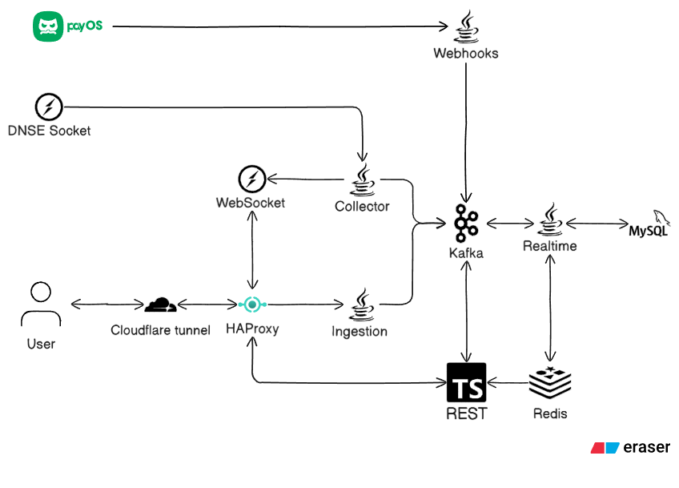
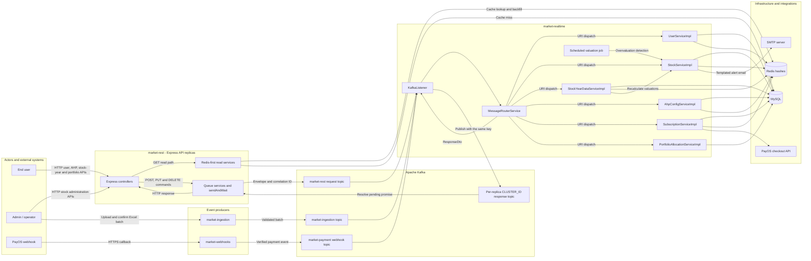

# FinSight

### Microservices platform for real-time stock analytics and long-term investment decision support

[](https://finsight.vuhongquang.com)
[](QUICK_DOCKER_SETUP.md)
[](k6-test/README.md)

FinSight combines streaming market prices, historical fundamentals, valuation models, personalized stock ranking, portfolio allocation, and historical strategy replay in a six-service platform. Five backend services and a React frontend communicate through REST, Apache Kafka, Redis, MySQL, and MQTT over WebSocket.

The backend is deliberately split into two execution planes:

- a low-latency read plane where two Node.js/Express replicas serve cache-backed and SQL-backed queries directly;
- an event and command plane where Kafka decouples REST commands, financial-data ingestion, live ticks, and payment callbacks from Spring Boot business processing.

**Repository:** <https://github.com/VuH0ngQuang/FinSight>  
**Live demo:** <https://finsight.vuhongquang.com>

## Performance

### Latest read-only REST benchmark

The latest reported k6 run targeted both Node.js/Express replicas with constant-arrival-rate traffic and per-VU upstream affinity for HTTP keep-alive reuse.

| Metric | Result |
|---|---:|
| Requests executed | **630,009** |
| Sustained target rate | **3,000 RPS** |
| Average expected-response latency at 3,000 RPS | **3.84 ms** |
| Semantic error rate at 3,000 RPS | **0.00%** |
| Stress target | **4,000 RPS** |
| Semantic error rate at 4,000 RPS | **0.00%** |

The benchmark isolates read-heavy API performance and treats only statuses configured as valid for each endpoint as semantic successes. Semantic error rate is therefore an application-level correctness metric; transport failures and dropped iterations should also be reviewed in the raw k6 summary when reproducing the test.

The test harness provides:

- configurable step-ramp RPS profiles;
- constant-arrival-rate scenarios;
- deterministic distribution across multiple REST replicas;
- success-only and all-response latency metrics;
- per-endpoint request, success, and error metrics;
- generated CSV and Markdown benchmark summaries.

<details>
<summary>Earlier thesis baseline</summary>

The thesis evaluation used three independent read-only runs from 100 to 1,000 RPS on a single co-located VPS with 10 Intel Xeon cores and 18 GB RAM. Mean successful-response latency stabilized around **4.8–5.1 ms** from 300 RPS onward, while P95 remained approximately **6.8–7.0 ms** at the upper load levels. That test identified connection acceptance—not request processing time—as the first bottleneck, with a conservative safe point near 300 RPS under its original infrastructure and error definition.

The thesis baseline and latest benchmark use different profiles and reporting semantics, so they should be treated as separate benchmark generations rather than directly compared.

</details>

## Event-driven architecture



The deployment view above shows the external integrations and service boundaries. The diagram below expands the backend request/reply, persistence, ingestion, payment, and alerting paths implemented by the current services.



### Why the backend is structured this way

1. **Reads stay short.** Stock, user, AHP, subscription, and historical-fundamental queries are served by Express through Redis-first cache paths with MySQL fallback and cache backfill.
2. **Commands cross Kafka.** Mutations and computational workflows are wrapped in typed envelopes with a URI, source service, event ID, timestamp, payload, and correlation key.
3. **Spring Boot owns business processing.** `market-realtime` consumes REST, ingestion, webhook, and market-data topics, routes each envelope to the appropriate domain service, persists results, invalidates or refreshes caches, and publishes correlated responses.
4. **Market ticks have two destinations.** The collector publishes Kafka events for durable backend processing and MQTT messages for lightweight browser delivery without HTTP polling.
5. **Batch ingestion is explicit.** Excel files are parsed and validated before confirmation; only approved batches are published for asynchronous persistence.

## Services

| Service | Runtime | Responsibility |
|---|---|---|
| `market-rest` | Node.js, Express, TypeScript | Low-latency REST read path, authentication endpoints, Kafka request/reply orchestration; deployed as two replicas |
| `market-realtime` | Java, Spring Boot | Kafka consumer and router, transactional business logic, valuation, TOPSIS, portfolio allocation, scheduled alerts, persistence |
| `market-collector` | Java, Spring Boot | DNSE market-feed connection, tick normalization, Kafka publication, MQTT browser fan-out |
| `market-ingestion` | Java, Spring Boot, Apache POI | Excel parsing, staging, validation, confirmation, and Kafka batch publication |
| `market-webhooks` | Java, Spring Boot | PayOS signature verification and payment-event publication |
| `market-frontend` | React, TypeScript, Vite | Analytics dashboard, live prices, stock scanner, valuation charts, AHP configuration, and portfolio UI |

## Core event flows

### REST command and correlated response

```text
HTTP request
  -> market-rest creates a typed Kafka envelope and correlation key
  -> market-realtime consumes and routes the command
  -> domain service updates MySQL/Redis or runs computation
  -> response is published to the originating REST replica
  -> pending HTTP promise resolves by correlation key
```

### Live market price

```text
DNSE MQTT/WebSocket feed
  -> market-collector parses and normalizes the tick
  -> Kafka event updates backend state through market-realtime
  -> MQTT publication reaches React through WebSocket
```

### Historical financial ingestion

```text
Excel upload
  -> Apache POI parsing and validation
  -> temporary Redis staging
  -> administrator confirmation
  -> Kafka batch
  -> market-realtime persistence and cache refresh
```

### Payment

```text
PayOS callback
  -> signature verification in market-webhooks
  -> Kafka payment event
  -> subscription update in market-realtime
```

## Engineering highlights

- Six independently deployable services with fixed responsibilities.
- Two Express API replicas with per-replica Kafka consumer identities.
- Kafka request/reply correlation without direct REST-to-Java service calls.
- Redis cache-aside behavior for hot stock, user, subscription, AHP, and historical-data reads.
- MySQL persistence for users, stocks, subscriptions, preferences, and annual fundamentals.
- MQTT-over-WebSocket price delivery without repeated browser polling.
- Seven valuation signals: DDM, DCF, Residual Income, P/E, P/B, P/CF, and P/S.
- Personalized AHP weights with TOPSIS ranking and score-proportional portfolio allocation.
- Historical replay/backtest engine with point-in-time snapshots, transaction costs, and annual rebalancing.
- Spring scheduled jobs for trading-session feed control and overvaluation alerts.
- Thymeleaf email templates and PayOS subscription integration.
- JUnit tests for performance metrics, portfolio state, industry medians, AHP configuration, and backtest calculations.

## Technology stack

| Layer | Technologies |
|---|---|
| REST and read plane | Node.js, Express 5, TypeScript, KafkaJS, mysql2, Redis |
| Event and compute plane | Java 21, Spring Boot, Spring Data JPA, Apache Kafka |
| Live data | MQTT, MQTT over WebSocket, DNSE market feed |
| Frontend | React 19, TypeScript, Vite, Tailwind CSS, Recharts |
| Storage | MySQL 8.4, Redis 7.4 |
| Ingestion and notifications | Apache POI, Spring Scheduler, Thymeleaf, SMTP |
| Deployment and testing | Docker Compose, Nginx, k6, JUnit |

## Quick start

Requirements: Docker Engine with Compose, or Docker Desktop, with at least 8 GB RAM and 15 GB free disk space.

Windows:

```powershell
.\quick-docker-setup.cmd
```

Linux or macOS:

```bash
./quick-docker-setup.sh
```

The one-command setup creates local credentials, starts MySQL/Redis/Kafka/MQTT, imports the bundled thesis dataset, creates Kafka topics, builds the services, and waits for the REST health check.

After startup:

- Application: <http://localhost:8080>
- Health: <http://localhost:8080/health>
- Swagger UI: <http://localhost:8080/api-docs/>

See [QUICK_DOCKER_SETUP.md](QUICK_DOCKER_SETUP.md) for status, logs, shutdown, and database-reset commands. The live collector and payment webhook profiles require authorized third-party credentials and are disabled by default.

## Reproduce the k6 test

Install [k6](https://grafana.com/docs/k6/latest/set-up/install-k6/), start the local stack, then run a read-only profile:

```bash
k6 run \
  -e BASE_URL=http://localhost:8080 \
  -e READ_ONLY=true \
  -e RPS_STEPS=100,300,500,1000 \
  -e STEP_DURATION=30s \
  k6-test/load-test.js
```

For direct two-replica testing on a Linux Docker host:

```bash
k6 run \
  -e BASE_URL=http://10.255.254.10:3000,http://10.255.254.11:3000 \
  -e READ_ONLY=true \
  -e RPS_STEPS=100,500,1000,2000,3000 \
  k6-test/load-test.js
```

Do not run high-RPS tests against the public demo without authorization. See [k6-test/README.md](k6-test/README.md) and [k6-test/load-test.js](k6-test/load-test.js) for endpoint weights, thresholds, side-effect controls, and exported reports.

## Tests

Backend build and unit tests:

```bash
cd market-realtime
./mvnw test
```

REST type-check/build:

```bash
cd market-rest
npm ci
npm run build
```

Frontend lint and production build:

```bash
cd market-frontend
npm ci
npm run lint
npm run build
```

## Repository layout

```text
FinSight/
├── market-rest/          # TypeScript REST and Kafka request/reply layer
├── market-realtime/      # Java event router, domain logic, analytics, backtest
├── market-collector/     # DNSE feed consumer and Kafka/MQTT publisher
├── market-ingestion/     # Excel validation and ingestion workflow
├── market-webhooks/      # PayOS webhook verification
├── market-frontend/      # React analytics application
├── k6-test/              # Configurable API load-test harness
├── deployment/           # Local Nginx, Mosquitto, and thesis DB snapshot
├── docker-compose.yml
└── docker-compose.local.yml
```

## Documentation

- [Quick Docker setup](QUICK_DOCKER_SETUP.md)
- [Full Docker deployment guide](DOCKER_SETUP_GUIDE.md)
- [k6 load-test guide](k6-test/README.md)
- [Collector tick flow](market-collector/FLOWCHART.md)
- [Realtime tick update flow](market-realtime/TICK_PRICE_UPDATE_FLOWCHART.md)

## Disclaimer

FinSight is an academic decision-support project. Its valuations, rankings, backtests, and portfolio allocations are not financial advice.
